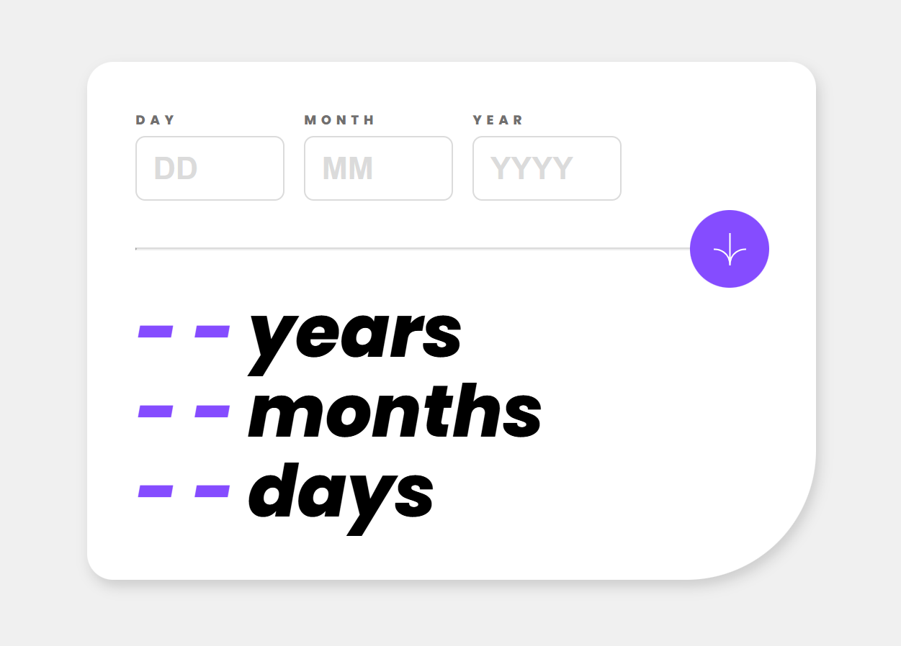

# Frontend Mentor - Age calculator app solution

This is a solution to the [Age calculator app challenge on Frontend Mentor](https://www.frontendmentor.io/challenges/age-calculator-app-dF9DFFpj-Q). Frontend Mentor challenges help you improve your coding skills by building realistic projects. 

## Table of contents

- [Overview](#overview)
  - [The challenge](#the-challenge)
  - [Screenshot](#screenshot)
  - [Links](#links)
- [My process](#my-process)
  - [Built with](#built-with)
  - [What I learned](#what-i-learned)
  - [Continued development](#continued-development)
  - [Useful resources](#useful-resources)
- [Author](#author)
- [Acknowledgments](#acknowledgments)

**Note: Delete this note and update the table of contents based on what sections you keep.**

## Overview

### The challenge

Users should be able to:

- View an age in years, months, and days after submitting a valid date through the form
- Receive validation errors if:
  - Any field is empty when the form is submitted
  - The day number is not between 1-31
  - The month number is not between 1-12
  - The year is in the future
  - The date is invalid e.g. 31/04/1991 (there are 30 days in April)
- View the optimal layout for the interface depending on their device's screen size
- See hover and focus states for all interactive elements on the page
- **Bonus**: See the age numbers animate to their final number when the form is submitted

### Screenshot



### Links

- Solution URL: [solution URL](https://github.com/AIY7788/age-calculator-app-react)
- Live Site URL: [live site URL](https://aiy7788.github.io/age-calculator-app-react/)

## My process

### Built with

- Semantic HTML5 markup
- Flexbox
- Mobile-first workflow
- React (Vite)
- Day.js for date handling

### What I learned

This project helped me understand:

Day.js date validation
Calculate age correctly
Handling invalid ranges:
  Reject future years
  Reject days that exceed actual month length
  Reject non-numeric values
Controlled form inputs in React

To see how you can add code snippets, see below:

```js
const dob = dayjs(`${year}-${month}-${day}`);

if (!dob.isValid()) {
  setError("invalid");
}

const years = today.diff(dob, "year");
const afterYears = dob.add(years, "year");

const months = today.diff(afterYears, "month");
const afterMonths = afterYears.add(months, "month");

const days = today.diff(afterMonths, "day");

setDate(prev => ({
  ...prev,
  [name]: value,
}));

```

### Continued development

In future improvements, I plan to:
Add smooth animations for age output
Add better accessibility (ARIA labels)
Improve input UX (auto-formatting DD/MM/YYYY)
Add unit tests for validation logic

### Useful resources

- [Day.js Documentation](https://day.js.org/)
- [w3schools](https://www.w3schools.com/) 

## Author

- Frontend Mentor - [@AIY7788](https://www.frontendmentor.io/profile/AIY7788)
- GitHub - [@AIY7788](https://github.com/AIY7788)

## Acknowledgments

Thanks to Frontend Mentor for providing this challenge, and the community for sharing helpful tips and inspiration.
